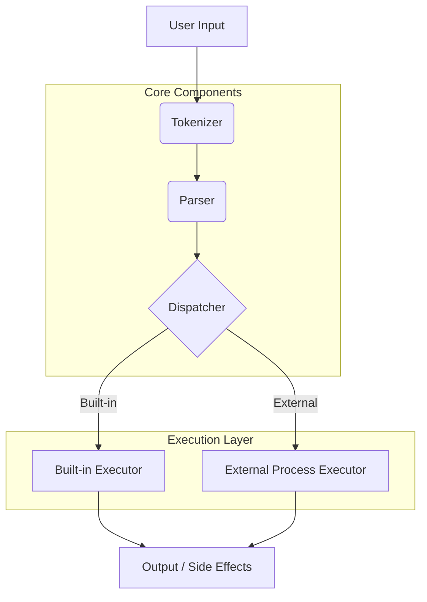

# 🐚 TypeScript Shell


A robust, POSIX-compliant shell implementation built entirely in **TypeScript**. This project demonstrates advanced concepts in language processing, system interaction, and process management, serving as a powerful addition to any developer's toolkit.

## 🚀 Introduction

This shell is designed to be a lightweight yet feature-rich command-line interpreter. It supports standard shell functionalities like command execution, piping, I/O redirection, and persistent history, all while maintaining a clean and modular codebase. Whether you're exploring shell internals or need a custom shell environment, this project provides a solid foundation.

## ✨ Key Features

- **Built-in Commands**: Essential commands like `cd`, `pwd`, `echo`, `type`, `exit`, and `history` are implemented natively.
- **I/O Redirection**: Full support for standard output and error redirection:
  - `>` : Overwrite output to a file.
  - `>>`: Append output to a file.
  - `2>`: Overwrite standard error to a file.
  - `2>>`: Append standard error to a file.
- **Piping**: Chain commands together using `|` to pass output from one process as input to another.
- **Persistent History**:
  - Maintains a history of commands across sessions.
  - Supports `HISTFILE` environment variable.
  - `history` command with flags `-r` (read), `-w` (write), and `-a` (append).
- **Autocompletion**: Intelligent tab completion for built-in commands and executables in your `$PATH`.
- **External Execution**: Seamlessly executes any external program available in your system's path.
- **Robust Parsing**: Handles complex command structures, including quoted strings (single `'` and double `"`), escape characters, and comments (`#`).

## 🏗️ Architecture

The shell follows a modular, layered architecture to ensure separation of concerns and maintainability.



### Component Breakdown

1.  **Tokenizer (`app/components/tokenizer.ts`)**: Breaks raw input strings into meaningful tokens, handling whitespace, quotes, and special characters.
2.  **Parser (`app/components/parser.ts`)**: Analyzes tokens to construct a structured command object, identifying commands, arguments, and redirections.
3.  **Dispatcher (`app/components/dispatcher.ts`)**: Orchestrates execution. It determines if a command is a built-in or external program and manages pipes and redirections.
4.  **Executor (`app/utils/execExternalCommand.ts`)**: Uses Node.js `child_process` to spawn external processes.

## 🛠️ Installation & Usage

### Prerequisites

- **[Bun](https://bun.sh/)** (v1.2 or later) is required to run this project.

### Getting Started

1.  **Clone the repository:**
    ```bash
    git clone https://github.com/yourusername/typescript-shell.git
    cd typescript-shell
    ```

2.  **Install dependencies:**
    ```bash
    bun install
    ```

3.  **Run the shell:**
    ```bash
    ./your_program.sh
    ```

## 📖 Supported Commands

| Command | Description | Usage Example |
| :--- | :--- | :--- |
| `cd` | Change the current working directory. | `cd /path/to/dir` or `cd ~` |
| `pwd` | Print the current working directory. | `pwd` |
| `echo` | Display a line of text. | `echo "Hello World"` |
| `type` | Display information about command type. | `type ls` |
| `history` | View or manipulate command history. | `history` or `history -a my_history.txt` |
| `exit` | Exit the shell. | `exit` |

## 📂 Project Structure

```
.
├── app/
│   ├── main.ts                 # Entry point
│   ├── builtins/               # Built-in command implementations
│   │   └── builtins.ts
│   ├── components/             # Core logic
│   │   ├── tokenizer.ts        # Lexical analysis
│   │   ├── parser.ts           # Syntax analysis
│   │   ├── dispatcher.ts       # Command routing
│   │   └── completer.ts        # Tab completion
│   ├── utils/                  # Utilities
│   │   ├── execExternalCommand.ts
│   │   ├── history.ts
│   │   └── pathCache.ts
│   └── types/                  # TypeScript type definitions
├── docs/                       # Documentation
├── your_program.sh             # Startup script
└── README.md                   # Project documentation
```

## 🤝 Contributing

Contributions are welcome! Please feel free to submit a Pull Request.

1.  Fork the project
2.  Create your feature branch (`git checkout -b feature/AmazingFeature`)
3.  Commit your changes (`git commit -m 'Add some AmazingFeature'`)
4.  Push to the branch (`git push origin feature/AmazingFeature`)
5.  Open a Pull Request

---

Built with ❤️ using TypeScript and Bun.
