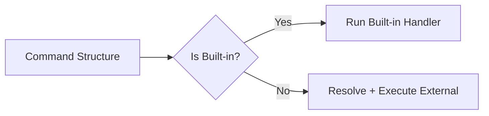

# 🐚 Shell Implementation Architecture

> A layered approach to building a command-line shell interpreter

---

## 📋 Table of Contents

- [Layer 1: Lexer &amp; Tokenizer](#layer-1-lexer--tokenizer)
- [Layer 2: Parser](#layer-2-parser)
- [Layer 3: Dispatcher &amp; Executor](#layer-3-dispatcher--executor)
- [Layer 4: Command Resolver](#layer-4-command-resolver)

---

## Layer 1: Lexer & Tokenizer

### 🎯 Purpose

The lexer is responsible for breaking down raw input into meaningful tokens.

### 📥 Process Flow

1. **Reads characters** from input stream
2. **Groups characters** that belong together
3. **Produces list of tokens** as output

### ✨ Features Implementation

The lexer handles the following:

1. **Handling quotes** (single and double)
2. **Handling whitespaces and spaces**
3. **Distinguishing** commands from arguments
4. **Escape characters** (`\`)
5. **Special characters** (`|`, `>`, `<`, `>>`, `&&`, `;`)
6. **Comments** starting with `#`

### 📤 Output Format

**Type:** `string[]` (array of tokens)

### 💡 Example

**Input:**

```bash
echo "Hello   world" foo\ bar 'baz'
```

**Output:**

```typescript
['echo', 'Hello   world', 'foo bar', 'baz']
```

> ⚠️ **Important:** This layer does NOT know what a command is — it only tokenizes!

---

## Layer 2: Parser

### 🎯 Purpose

A tiny but crucial layer that decides the command name, arguments, and options.

### 📥 Process Flow

1. **Takes list of tokens** from the lexer
2. **Understands** what is a command and what is an argument
3. **Builds a command structure** that can be executed by the shell

### 📐 Rules

- `tokens[0]` → **Command**
- Rest → **Arguments**

### 📤 Output Format

**Type:** Object with command name and arguments array

### 💡 Example

**Input:**

```bash
echo "Hello   world" foo\ bar 'baz'
```

**Output:**

```typescript
{
  command: 'echo',
  args: ['Hello   world', 'foo bar', 'baz']
}
```

---

## Layer 3: Dispatcher & Executor

### 🎯 Purpose

Execute commands with proper built-in handling and external command execution.

### 📥 Process Flow

1. **Takes the command structure** from the parser
2. **Looks up the command** in shell's built-in commands or external commands
3. **Executes the command** with provided arguments and options
4. **Handles** input/output redirection, piping, and background execution

### 🔧 Responsibilities



- ✅ Check if command is built-in
- ✅ If yes → run built-in handler
- ✅ Else → resolve + execute external

### 🏗️ Built-ins Architecture

Each built-in is a **pure function**:

```typescript
(args: string[]) => void | Promise<void>
```

> 🔍 **Note:** No parsing happens here — only execution!

---

## Layer 4: Command Resolver

### 🎯 Purpose

A utility layer for path resolution and command lookup.

### 📥 Process Flow

1. **Resolves the command name** to an executable file path
2. **Searches through directories** listed in the `PATH` environment variable
3. **Checks for executable permissions**
4. **Returns** the full path to the executable file or an error if not found

### 🔧 Responsibilities

- 📖 Read `PATH` environment variable
- ✂️ Split into directories
- 🔍 For each directory:
  - Check if command exists
  - Verify executable permissions
- ✅ Return full path or error

---

## 🏛️ Architecture Overview

```
┌─────────────────────────────────────────┐
│  Layer 1: Lexer & Tokenizer             │
│  Input → Tokens                          │
└──────────────┬──────────────────────────┘
               │
               ▼
┌─────────────────────────────────────────┐
│  Layer 2: Parser                         │
│  Tokens → Command Structure              │
└──────────────┬──────────────────────────┘
               │
               ▼
┌─────────────────────────────────────────┐
│  Layer 3: Dispatcher & Executor          │
│  Command Structure → Execution           │
└──────────────┬──────────────────────────┘
               │
               ▼
┌─────────────────────────────────────────┐
│  Layer 4: Command Resolver (Utility)     │
│  Command Name → Executable Path          │
└─────────────────────────────────────────┘
```

---

*Built with ❤️ using TypeScript*

  Finally, Layer 5:- execution

  1 run external program

  2 pass arguements and options

3. manage standard input/output/error streams

  4 handle process termination and exit codes

5. manage background and foreground processes

  This layer does nothing else

    */
